# NotOnlyFans

NotOnlyFans is an open source, self-hosted digital content subscription platform like `onlyfans.com`. The difference, however, is that it uses cryptocurrency (ETH) for payment, so the content will no longer be judged by the payment platform and credit card companies.

[简体中文](README.cn.md)

## Screenshots

### Register and login page

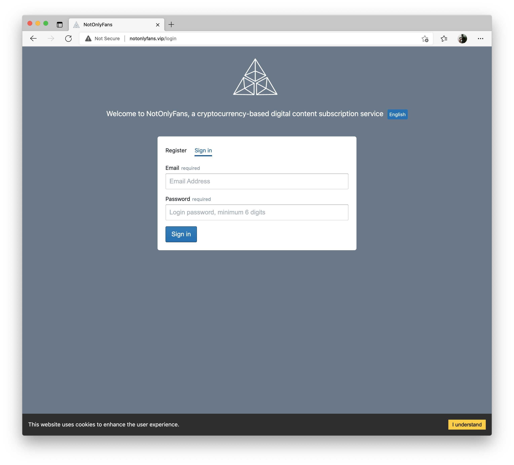

### Create column

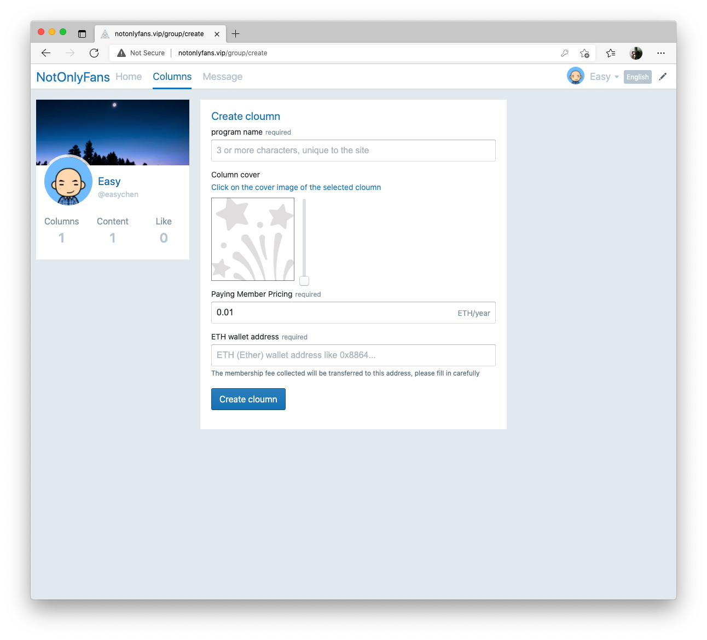

### Column view

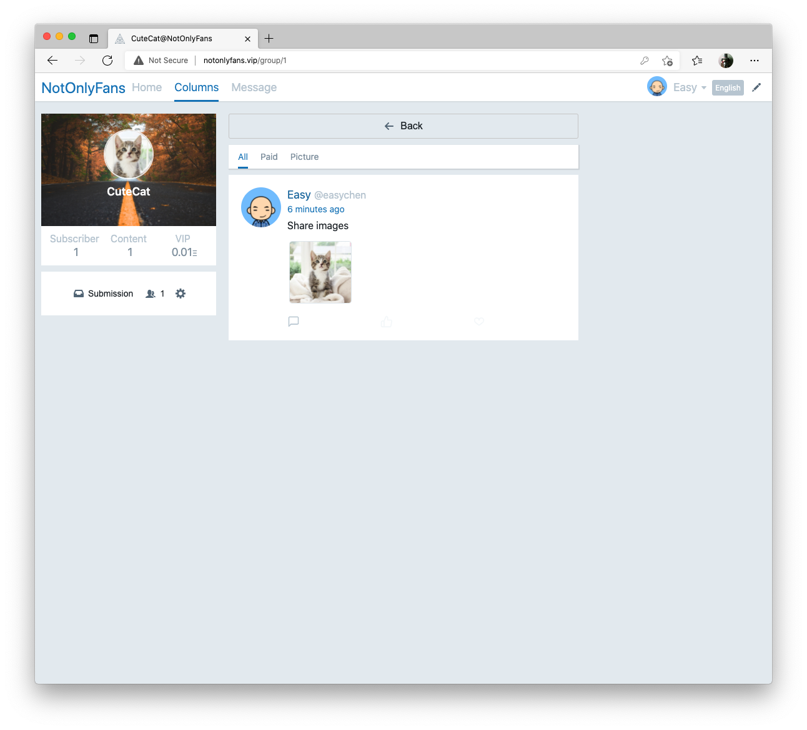

### Home feeds

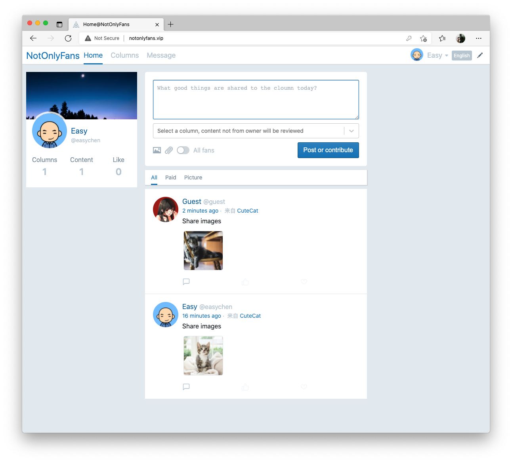

### Purchase column VIP via ETH

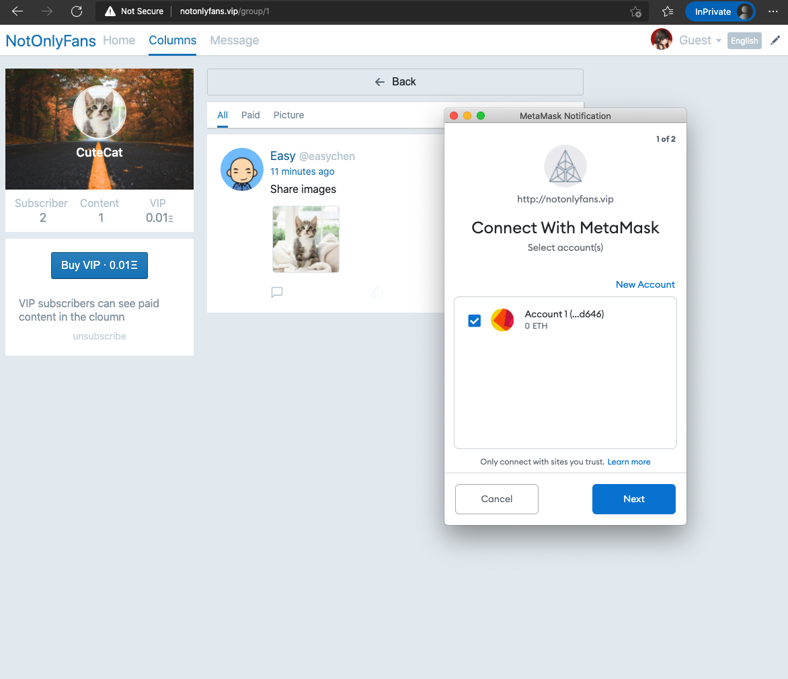

### Subscribe and review

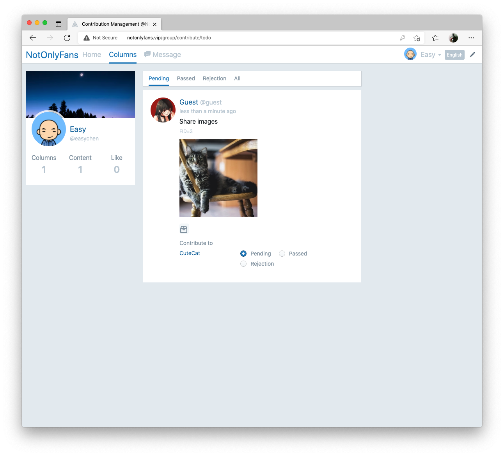

### Message box

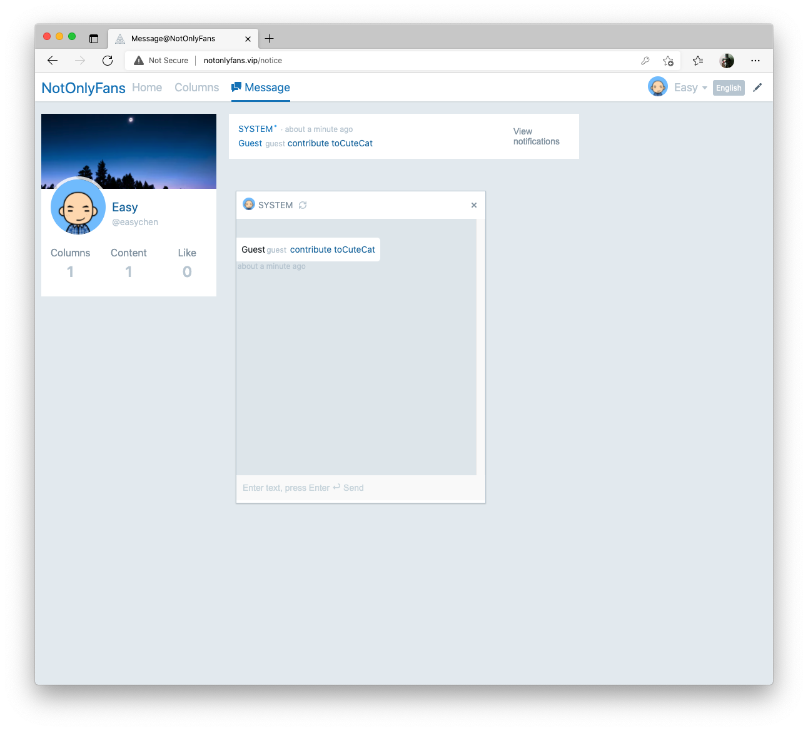

### Modify profile

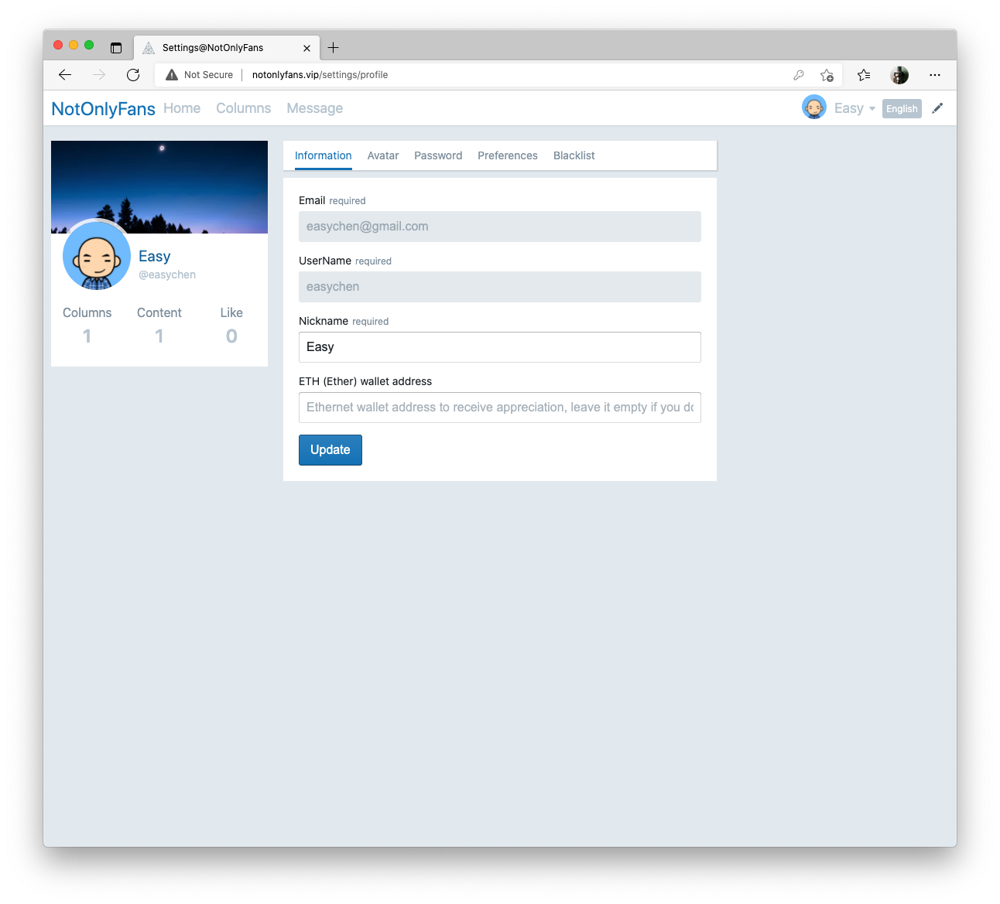

### Modify personal background image

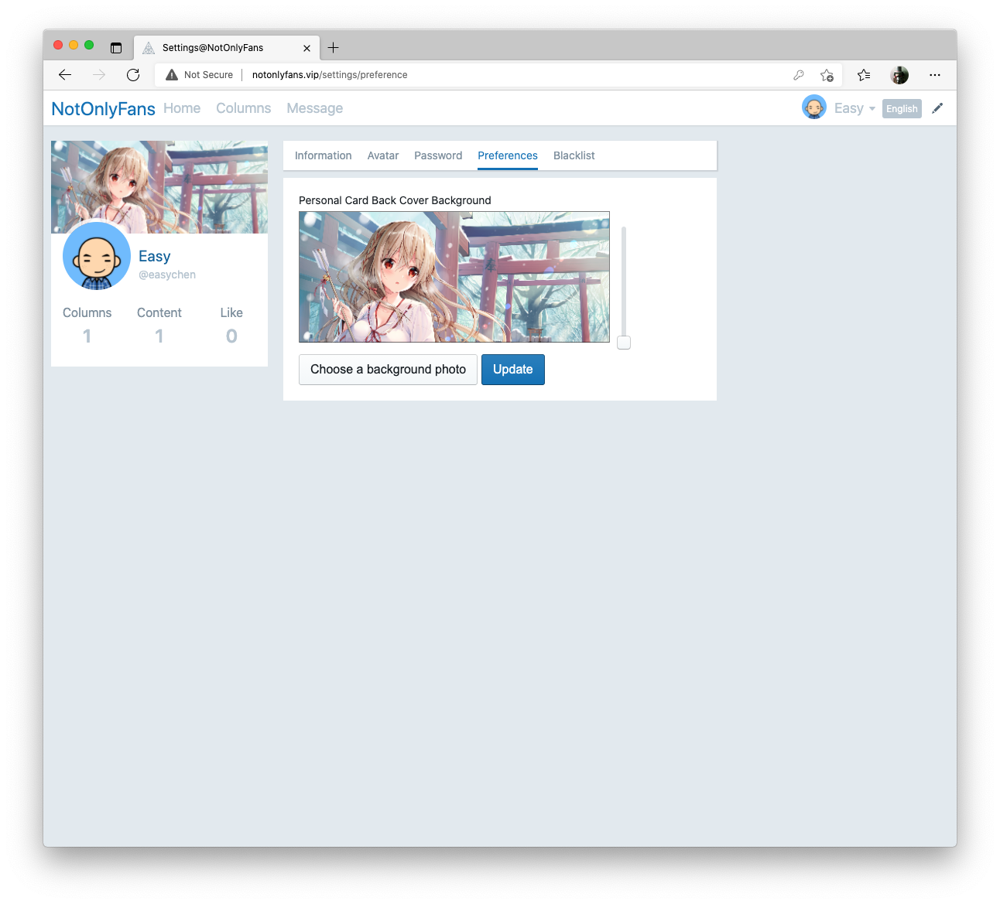

### Blacklist

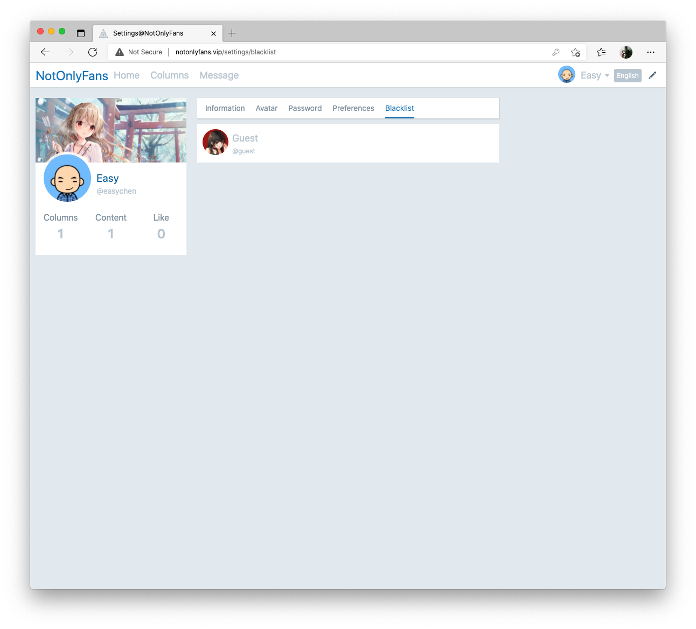

### Multi-language

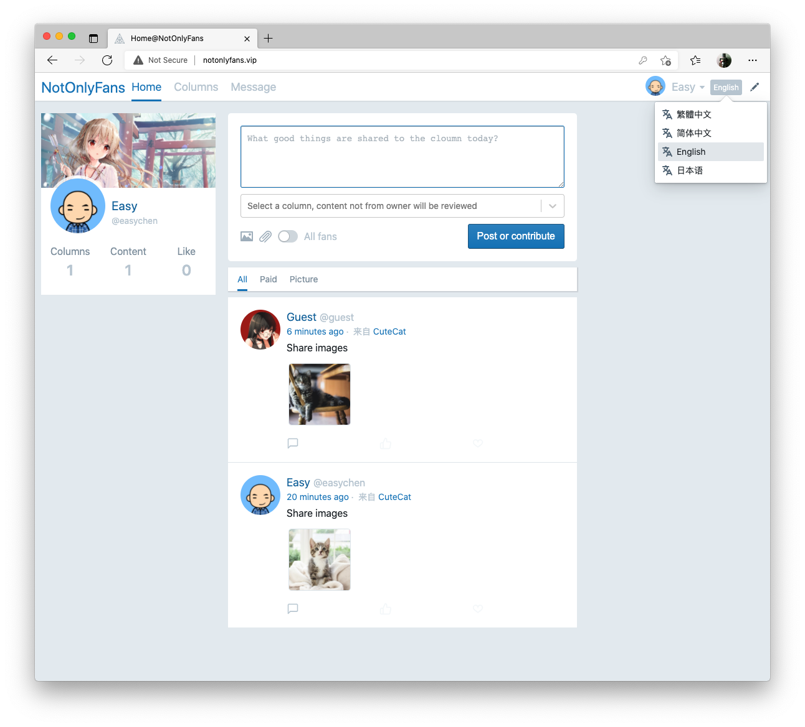


<!-- ## Online demo site

- <http://notonlyfans.vip/> -->

## Self-hosted

### Installation requirements

First we need to prepare a server with `docker` and `docker-compose` already installed, this server IP is noted as `SIP`.

### Clone the code and start Docker

```bash
git clone https://gitlab.com/easychen/not-only-fans.git
cd not-only-fans
docker-compose up -d --build
```

### Initialize project data 

Start by looking at the running Docker container.

```bash
docker ps
```

Record the container ID of the image as `not-only-fans_app` (CID for short), and then go inside the container.

```bash
docker exec -it ${container_id} /bin/bash
```

### Initialize the web front end

```bash
cd /app/client/ && yarn install && yarn build
```

### Initialize the API

```bash
cd /app/api/ && composer install && mkdir /app/api/storage && chmod -R 0777 /app/api/storage
```

### Domain pointing

This image uses different domains to point to different directories, you can point the following two domains to the server IP (i.e. SIP before) in localhost.

1. `notonlyfans.vip` → SIP (front-end domain)
1. `api.notonlyfans.vip` → SIP (API domain name)

Access at this point is ready for testing.

## Customization

### Use your own domain name

1. Modify `docker/app/vhost.conf` and replace the front-end domain and API domain with your own.
1. modify `www/client/.env.production` and replace the domain name in `REACT_APP_API_BASE` with your API domain name
1. modify `www/api/config/app.php` and replace the front-end domain name in it with your front-end domain name

### Use your own infura

1. Go to https://infura.io/ to open the service, click on the project name in [Dashboard](https://infura.io/dashboard/ethereum) and copy the Key in `Settings`.
1. Note that you can select the main or test network as needed.
1. Update `www/api/config/app.php` where `web3_network` is located.

### Use your own contract

1. modify `www/api/contract/group.js` and `www/api/contract/deploy.js`
1. deploy via `deploy.js`
1. Fill in the address of the deployed contract in `www/api/config/app.php` in the corresponding place


Translated with www.DeepL.com/Translator 
